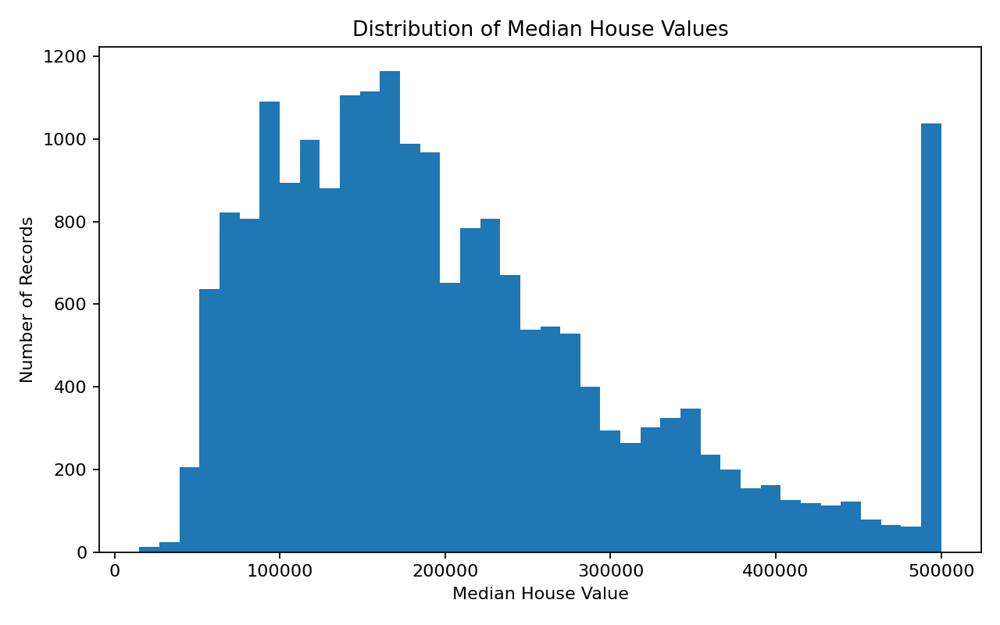
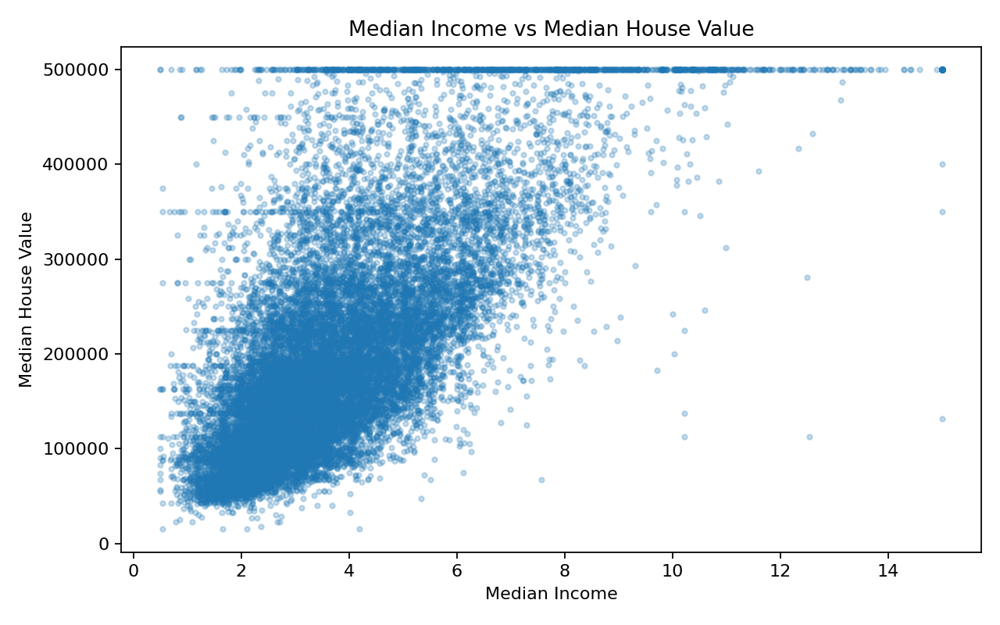
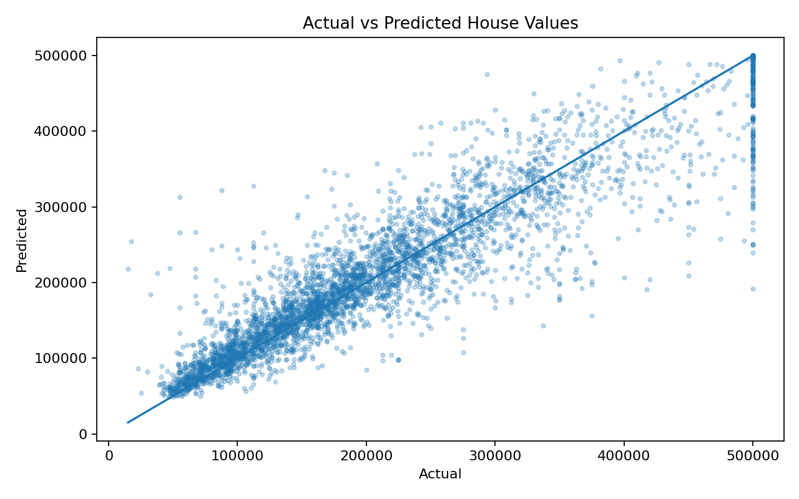

# 🏠 Gurgaon House Price Prediction

> An end-to-end **Machine Learning regression project** that prepares housing data, compares regression models, builds a reusable preprocessing pipeline, trains a Random Forest model, saves the model with Joblib, and generates house-value predictions.


## 🎯 Project Objective

Predict `median_house_value` from housing and location-related features using a reproducible machine-learning pipeline.

## 💼 Why this project

This project is designed as a portfolio-ready ML system rather than only a notebook:
- reproducible preprocessing
- model training and evaluation
- saved model + preprocessing pipeline
- batch prediction
- interactive Streamlit demo
- visual analysis and documentation

## 🧠 What this project demonstrates

- Data loading and preparation with **Pandas**
- Stratified train/test splitting
- Missing-value imputation
- Numerical feature scaling
- Categorical feature encoding
- `ColumnTransformer` + `Pipeline`
- Model comparison:
  - Linear Regression
  - Decision Tree Regressor
  - Random Forest Regressor
- Cross-validation with RMSE
- Model persistence using **Joblib**
- Batch inference on new input data
- Basic model evaluation and visualization
- Streamlit prediction demo

## 🔄 ML Workflow

```text
Raw Housing Data
       ↓
Stratified Split
       ↓
Feature / Target Separation
       ↓
 ┌───────────────┐
 │ Preprocessing │
 │               │
 │ Median Impute │
 │ StandardScale │
 │ OneHotEncode  │
 └───────────────┘
       ↓
Model Comparison
       ↓
Random Forest
       ↓
Save Model + Pipeline
       ↓
Inference
       ↓
Predicted House Value
```

## 📊 Dataset

The supplied dataset contains **20,640 rows and 10 columns**, with `median_house_value` as the target.

### Important note

The the portfolio project is named **Gurgaon House Price Prediction** as requested, but the uploaded dataset itself contains the feature `ocean_proximity` and the familiar housing fields used in the supplied code. The provided files therefore do **not** establish that this is a Gurgaon-specific dataset. The model should not be presented as a Gurgaon-trained model until verified Gurgaon/Delhi-NCR property data is used.

## 📈 Evaluation on the supplied inference set

| Metric | Value |
|---|---:|
| RMSE | $47,197.67 |
| MAE | $30,929.48 |
| R² | 0.8291 |
| Training dataset rows | 20,640 |
| Inference rows | 4,128 |

These metrics are calculated from the supplied `test_input.csv` actual target values and the supplied prediction output.

## 🖼️ Visualizations

### Target distribution


### Income vs House Value


### Actual vs Predicted


## 📁 Project Structure

```text
gurgaon-house-price-prediction/
├── README.md
├── LICENSE
├── requirements.txt
├── app.py
├── data/
│   ├── housing.csv
│   └── test_input.csv
├── models/
│   └── pipeline.pkl
├── src/
│   ├── original_main.py
│   ├── model_comparison.py
│   └── predict.py
├── notebooks/
│   └── 01_project_workflow.md
├── outputs/
│   ├── predictions.csv
│   └── metrics.json
├── assets/
│   ├── target_distribution.png
│   ├── income_vs_value.png
│   └── actual_vs_predicted.png
└── docs/
    └── data_dictionary.md
```

## 🚀 Run Locally

```bash
git clone <your-repository-url>
cd gurgaon-house-price-prediction
pip install -r requirements.txt
python src/predict.py
```

## 🌐 Run the interactive demo

```bash
streamlit run app.py
```

Then open the local Streamlit URL shown in the terminal.

## 🔐 Model & Pipeline

The project stores the trained Random Forest model and fitted preprocessing pipeline separately:

- `models/pipeline.pkl`

> **Note:** `models/model.pkl` is intentionally excluded from GitHub because the trained Random Forest artifact is about 138 MB, exceeding GitHub's 100 MB per-file limit. The model should be generated locally by the training workflow.

The original training script uses a `RandomForestRegressor` and saves the model and preprocessing artifacts with Joblib. The large trained model artifact is intentionally kept out of the Git repository.

## 💡 Future Improvements

- Replace the current dataset with verified **Gurgaon/Delhi-NCR property data** if Gurgaon-specific prediction is the actual business goal.
- Add hyperparameter tuning.
- Add feature importance / SHAP explainability.
- Add prediction confidence or uncertainty analysis.
- Add a proper API using FastAPI.
- Containerize with Docker.
- Deploy the Streamlit application.

## 👨‍💻 Author

**Dinesh Chauhan**  
B.Tech 2026 | Aspiring Data Scientist  
Python · SQL · Machine Learning · RAG

---

⭐ If you find this project useful, consider starring the repository.

## 🔎 Repository Description

**Gurgaon House Price Prediction** — an end-to-end machine-learning regression project with reusable preprocessing, model persistence, batch inference, evaluation, visualization, and a Streamlit interface.

**Recommended GitHub repository description:**
> End-to-end ML regression project for house-value prediction using Scikit-learn, preprocessing pipelines, Random Forest, Joblib and Streamlit.
